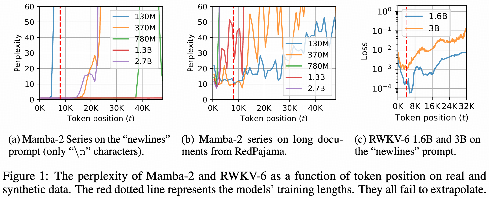
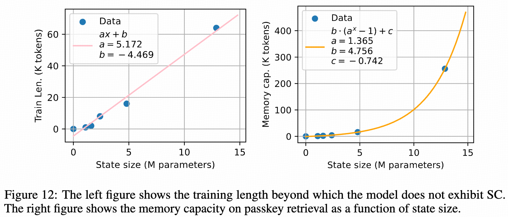

# Stuffed Mamba: State Collapse and State Capacity of RNN-Based Long-Context Modeling

This is the official code for the paper [Stuffed Mamba: State Collapse and State Capacity of RNN-Based Long-Context Modeling](https://arxiv.org/abs/2410.07145). 

## Introduction

We examine two practical concerns when applying state-of-the-art RNNs to long contexts:

1. The inability to extrapolate to inputs longer than the training length.
2. The upper bound of memory capacity.

Addressing the first concern, we first investigate state collapse (SC), a phenomenon that causes severe performance degradation on sequence lengths not encountered during training. With controlled experiments, we attribute this to overfitting due to the recurrent state being overparameterized for the training length. For the second concern, we train a series of Mamba-2 models on long documents to empirically estimate the recurrent state capacity in language modeling and passkey retrieval.

## Code Overview

- The `analysis` directory contains the source code for the analysis experiments. It also contains the code for computing perplexity as a function of context length.
- The `passkey-retrieval` directory contains the source code for evaluating Mamba-2, RWKV-5, and RWKV-6 in passkey retrieval.

## Setup

The code is tested with:

- PyTorch 2.3
- Python 3.12
- Transformers 4.45.2

Other required libraries are listed in `requirements.txt`.

For running HGRN-2, you also need to install FlashLinearAttention from: https://github.com/sustcsonglin/flash-linear-attention.

## Model Checkpoints

The checkpoints of Mamba-2 trained on longer sequences will be released soon.

## Acknowledgements

A large part of the code for passkey retrieval evaluation is copied from <https://www.github.com/OpenBMB/InfiniteBench>.
