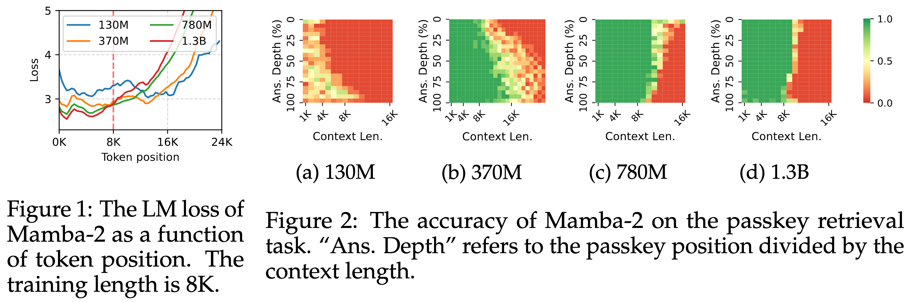
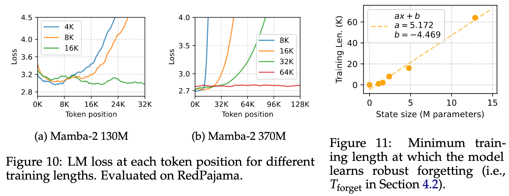

<div align="center"> </div>
<h1 align="center">Stuffed Mamba: Oversized States Lead to the Inability to Forget</h1>

This is the official code for the COLM 2025 paper [Stuffed Mamba: Oversized States Lead to the Inability to Forget](https://arxiv.org/abs/2410.07145), by **Yingfa Chen\*, Yutong Wu\*, Chenyang Song, Zhen Leng Thai, Xingyu Shen, Xu Han, Zhiyuan Liu, Maosong Sun**.

To contact the authors, please email to:  <span style="font-family: monospace;">chenyingfa1999@gmail.com, wuyutong_yuna@163.com</span>

## Introduction

RNNs/SSMs are much more efficient than Transformers in processing long contexts, but they fail to extrapolate beyond the training context length. Why? 🤔

→ They do not know how to forget past information when the state is overloaded with memories.

This is surprising since models such as Mamba (selective SSM) have a built-in forgetting mechanism (i.e., the forget gate). However, because their recurrent state is overparameterized (too large), these models can achieve good langauge modeling performance without learning how to forget past information.



Based on the above hypothesis and supporting experimental analyses, we arrived at the following finding:

<p align="center" style="font-size: 16px;">
    Finding:<br>
</p>

*Let $N_S$ and $T_\text{train}$ denote the recurrent state size and training length, respectively, there exists a threshold $T_\text{forget} (N_S)$ such that the model learns to forget if and only if $T_\text{train} > T_\text{forget}$.*

<br>

We call $T_\text{forget}$ the *forget threshold*, and find that it scales linearly with the state size:



## Code Overview

- The `analysis` directory contains the source code for the analysis experiments (Section 4 in the paper). It also contains the code for computing perplexity as a function of context length.
- The `passkey-retrieval` directory contains the source code for evaluating Mamba-2, RWKV-5, and RWKV-6 in passkey retrieval.

For how to run the code to reproduce the results in the paper, checkout the README file inside the above directories.

## Setup

The code is tested with:

- PyTorch 2.3
- Python 3.12
- Transformers 4.45.2

Other required libraries are listed in `requirements.txt`.

For running HGRN-2, you also need to install FlashLinearAttention from: https://github.com/sustcsonglin/flash-linear-attention.

### Models & Data

To perform the analysis experiments, you also need the model checkpoints, which are downloaded from their respective official repositories. For instance, for Mamba-2, download the official checkpoints from <https://huggingface.co/state-spaces>. Of course, you also need the respective tokenizers. Then, you need to specify the paths to the checkpoints and tokenizers through command-line arguments (see the README in the subdirectories for more details).

For evaluating on synthetic data (such as passkey retrieval and the "newlines" prompt), you don't need to download any data. For training and evaluation on real data (such as RedPajama and SlimPajama), you need to download from the official sources, and specify the path through command-line arguments.

## TODOs

- The checkpoints of Mamba-2 trained on longer sequences will be released soon.
- Add the implementation of the training-free SC mitigation methods.

## Acknowledgements

A large part of the code is copied from the following sources:

- <https://www.github.com/OpenBMB/InfiniteBench>: For passkey evaluation.
- <https://github.com/state-spaces/mamba>: For the Mamba-2 implementation.
- The HuggingFace Transformers library: For RWKV implementation.

## Citation

To cite us, please use the following BibTeX.

```bibtex
@inproceedings{chen2024stuffed-mamba,
    title={Stuffed Mamba: Oversized States Lead to the Inability to Forget},
    author={Yingfa Chen and Xinrong Zhang and Shengding Hu and Xu Han and Zhiyuan Liu and Maosong Sun},
    year={2025},
    booktitle={Second Conference on Language Modeling},
    url={https://arxiv.org/abs/2410.07145}, 
}
```
